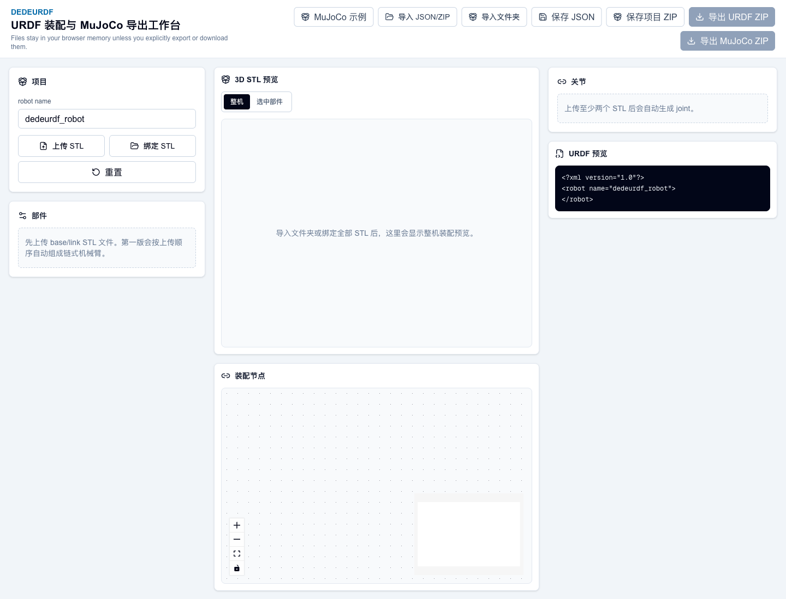
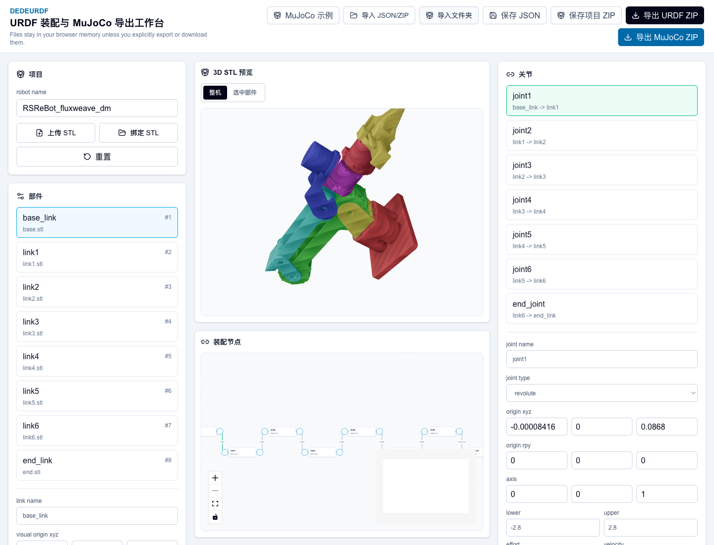
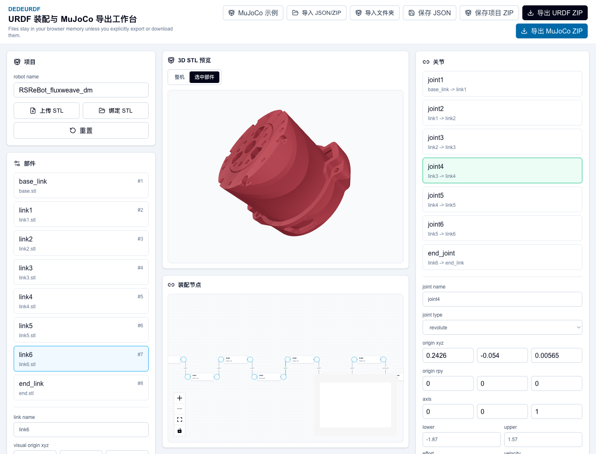
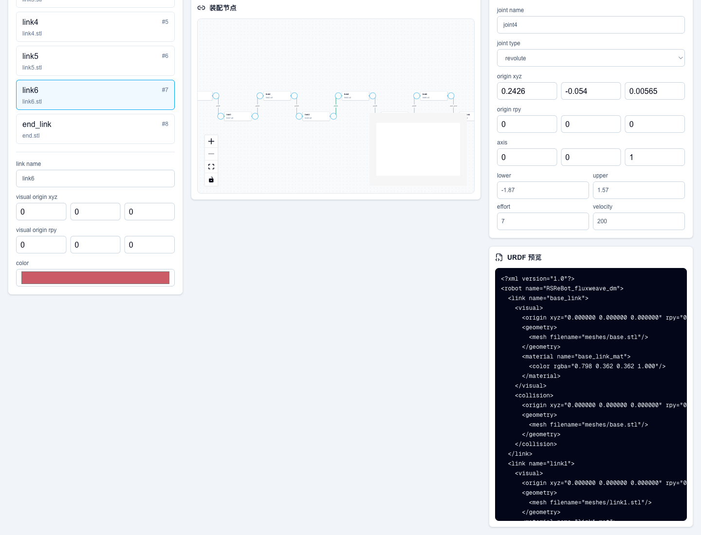

# DeDeUrdf 使用手册

DeDeUrdf 是一个浏览器端 URDF 装配工具。它可以把 STL 模型、关节参数和装配关系整理成可保存的项目，并导出普通 URDF ZIP 或 MuJoCo 可加载的 URDF ZIP。

在线访问：

<https://dedeurdf.vercel.app/>

本手册使用内置 RSReBot 示例项目演示完整流程。示例文件位于：

```text
public/examples/rsrebot-mujoco/
├── RSReBot_fluxweave_dm_project.json
└── metadata_stl/
    ├── base.stl
    ├── link1.stl
    ├── link2.stl
    ├── link3.stl
    ├── link4.stl
    ├── link5.stl
    ├── link6.stl
    └── end.stl
```

## 重要隐私说明

用户在页面里选择 STL、JSON、ZIP 或文件夹时，文件不会上传到 Vercel。DeDeUrdf 只在浏览器内存中读取和处理这些文件。

Vercel 只负责提供网页代码和内置示例资源。用户自己的机器人模型文件只有在用户手动保存或导出时，才会由浏览器生成本地下载文件。

## 1. 打开页面

打开在线地址后，会看到顶部导入/保存/导出按钮、左侧项目面板、中间 3D 预览和装配节点、右侧关节和 URDF 预览。



页面上最常用的入口：

- `MuJoCo 示例`：直接加载网站内置示例。
- `导入 JSON/ZIP`：导入保存过的项目 JSON 或项目 ZIP。
- `导入文件夹`：一次性导入项目 JSON 和所有 STL，最推荐用于完整项目。
- `上传 STL`：从零开始上传一批 STL，并按上传顺序自动生成初始链式结构。
- `绑定 STL`：当 JSON 已导入但 STL 文件没有绑定时，用它重新选择同名 STL。

## 2. 推荐方式：导入完整项目文件夹

如果你已经有项目 JSON 和 STL 文件，推荐使用 `导入文件夹`。

操作步骤：

1. 点击顶部 `导入文件夹`。
2. 选择包含项目 JSON 和 STL 的目录。
3. 浏览器会读取目录里的项目文件和 STL。
4. 导入成功后，部件列表、关节列表、装配图、3D 预览和 URDF 预览会一起恢复。

推荐文件夹结构：

```text
MyRobot/
├── project.fluxweave.json
└── meshes/
    ├── base.stl
    ├── link1.stl
    └── ...
```

也兼容这种结构：

```text
MyRobot/
├── RSReBot_fluxweave_dm_project.json
└── metadata_stl/
    ├── base.stl
    ├── link1.stl
    └── ...
```

导入完成后的状态如下。可以看到整机模型已经显示，顶部导出按钮也已经启用。



## 3. 其他导入方式

### 导入 JSON/ZIP

点击 `导入 JSON/ZIP` 可以选择：

- `*.json`：项目 JSON。
- `*.zip`：之前保存的项目 ZIP。

如果只导入 JSON，浏览器可能无法自动读取你电脑上的 STL 绝对路径。这时页面会恢复参数和结构，但 3D 预览可能缺 mesh，需要再点击 `绑定 STL` 选择同名 STL。

如果导入的是项目 ZIP，并且 ZIP 内包含 `meshes/` 或 `metadata_stl/` 里的 STL，一般可以直接恢复完整预览。

### 从零上传 STL

如果你还没有项目 JSON，可以点击左侧 `上传 STL`，一次选择多个 STL。DeDeUrdf 会按上传顺序生成初始链式机械臂：

```text
base_link -> link1 -> link2 -> link3 -> ...
```

这适合快速开始，但真正用于开发时，仍然需要继续校准每个 joint 的 origin、axis、limit 等参数。

## 4. 查看整机和单个部件

中间 `3D STL 预览` 有两个模式：

- `整机`：查看所有部件按当前关节关系装配后的效果。
- `选中部件`：只查看左侧当前选中的 STL，方便检查某一个零件方向、原点和几何细节。

示例中选中 `link6` 后，再切到 `选中部件`：


## 5. 编辑部件参数

左侧 `部件` 面板可以选择某个 link，并编辑：

- `link name`：URDF 中的 link 名称。
- `visual origin xyz`：视觉 mesh 相对 link 坐标系的位置，单位是米。
- `visual origin rpy`：视觉 mesh 相对 link 坐标系的姿态，单位是弧度。
- `color`：预览颜色和 URDF material 颜色。

如果 STL 在 CAD 中已经按照关节坐标系导出，通常 `visual origin xyz/rpy` 可以保持 0。  
如果 STL 原点不在关节坐标系上，可以在这里做补偿，但更推荐在 CAD 里先把 STL 原点处理好。

## 6. 编辑关节参数

右侧 `关节` 面板可以选择某个 joint，并编辑：

- `joint name`：URDF joint 名称。
- `joint type`：`fixed`、`revolute`、`continuous`、`prismatic`。
- `origin xyz`：child link 坐标系相对 parent link 坐标系的位置，单位是米。
- `origin rpy`：child link 坐标系相对 parent link 坐标系的姿态，单位是弧度。
- `axis`：关节运动轴。
- `lower / upper`：关节运动范围。
- `effort / velocity`：关节力矩/速度上限。

示例中选中 `joint4` 后，可以看到该关节的装配偏移、旋转轴和 limit：



常见经验：

- 旋转关节常用 `revolute`。
- 固定连接使用 `fixed`。
- 旋转轴通常是 `[0, 0, 1]`、`[0, 1, 0]` 或 `[1, 0, 0]`。
- 如果模型位置对不上，优先检查相邻两个关节坐标系的相对位置，也就是 `origin xyz`。

## 7. 查看装配节点

中间下方 `装配节点` 会显示 link 和 joint 的连接关系。节点可以拖动整理布局，连接线表示 parent link 到 child link 的关节关系。

图中每条边的名字就是 joint 名，例如：

```text
base_link -- joint1 --> link1
link1     -- joint2 --> link2
link2     -- joint3 --> link3
```

这个视图主要用于检查结构关系是否正确，尤其适合确认链路有没有断开或接错。

## 8. 查看 URDF 预览

右下角 `URDF 预览` 会实时显示当前项目生成的 URDF。你修改 link、joint、origin、axis、limit 后，这里的 XML 会同步变化。



如果你只想快速检查结构，可以先看：

- `<robot name="...">`
- `<link name="...">`
- `<joint name="..." type="...">`
- `<parent link="...">`
- `<child link="...">`
- `<origin xyz="..." rpy="...">`
- `<axis xyz="...">`

## 9. 保存和导出

顶部有四个保存/导出按钮：

| 按钮 | 用途 | 适合场景 |
|---|---|---|
| `保存 JSON` | 下载项目 JSON | 临时保存参数，文件小 |
| `保存项目 ZIP` | 下载项目 JSON + STL | 后续继续在 DeDeUrdf 中编辑 |
| `导出 URDF ZIP` | 下载普通 URDF 包 | 给 ROS、URDF 工具或其他机器人软件使用 |
| `导出 MuJoCo ZIP` | 下载 MuJoCo 兼容 URDF 包 | 给 MuJoCo 加载和仿真使用 |

普通 URDF ZIP 结构：

```text
robot_urdf.zip
├── project.fluxweave.json
├── urdf/
│   └── robot.urdf
└── meshes/
    └── *.stl
```

MuJoCo URDF ZIP 结构：

```text
robot_mujoco_urdf.zip
├── project.fluxweave.json
├── README.txt
├── urdf/
│   └── robot_mujoco.urdf
└── meshes/
    └── *.stl
```

MuJoCo 加载示例：

```bash
python - <<'PY'
import mujoco
model = mujoco.MjModel.from_xml_path("urdf/robot_mujoco.urdf")
print(model.nbody, model.njnt, model.ngeom)
PY
```

## 10. 推荐工作流

如果你从 CAD 软件导出自己的机械臂模型，推荐这样做：

1. 在 CAD 中拆分每个 link 的 STL。
2. 尽量让每个 STL 的原点对齐到对应 joint 坐标系。
3. 用米作为 URDF 单位。如果 CAD 导出是毫米，导入前要确认缩放。
4. 在 DeDeUrdf 中点击 `上传 STL` 或 `导入文件夹`。
5. 先确认整机大体姿态。
6. 逐个 joint 调整 `origin xyz/rpy` 和 `axis`。
7. 检查 `URDF 预览`。
8. 点击 `保存项目 ZIP` 保存可编辑版本。
9. 点击 `导出 MuJoCo ZIP` 或 `导出 URDF ZIP` 给仿真/控制工程使用。

## 11. 常见问题

### 导入 JSON 后没有 3D 模型

JSON 只保存参数和文件名，不一定包含 STL 文件本体。点击 `绑定 STL`，重新选择同名 STL；或者使用 `保存项目 ZIP` / `导入文件夹` 这种包含 STL 的方式。

### 模型位置不对

优先检查：

- STL 导出原点是否正确。
- 相邻 joint 的 `origin xyz` 是否是两个关节坐标系之间的相对位置。
- `origin rpy` 是否需要旋转补偿。
- `axis` 是否和真实关节旋转轴一致。

### 单位应该用毫米还是米

URDF 和 MuJoCo 通常按米理解。DeDeUrdf 中的 `origin xyz` 建议使用米。  
例如 CAD 中的 `86.8 mm` 应该写成：

```text
0.0868
```

### 用户文件会不会上传到 Vercel

不会。用户选择的 STL、JSON、ZIP 文件是在浏览器内存中解析，不会上传到 Vercel。只有网页本身和内置示例文件会从 Vercel 下载。

### STL 很大时页面比较慢

这是正常的。DeDeUrdf 在浏览器里解析和渲染 STL，文件越大，加载和 3D 预览越慢。正式项目建议给仿真和网页预览准备简化版 mesh。

## 12. 本地开发

```bash
cd /Users/dede/Downloads/Mujoco/DeDeUrdf
nvm use
npm install
npm run dev
```

打开：

```text
http://localhost:3000
```

部署到 Vercel：

```bash
npx vercel --prod
```
