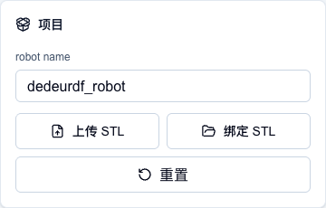
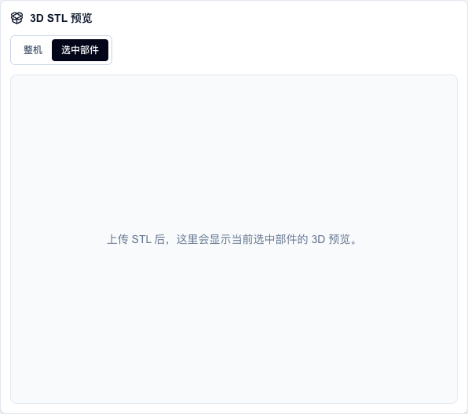
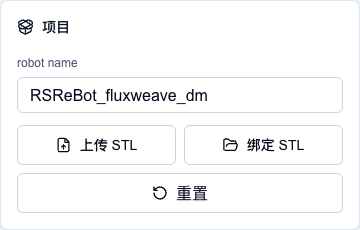
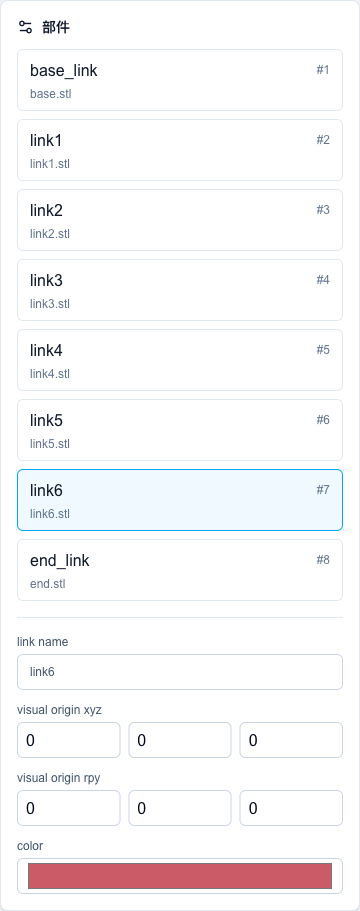
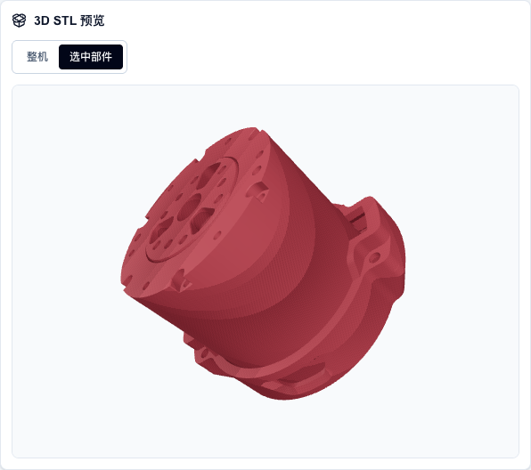
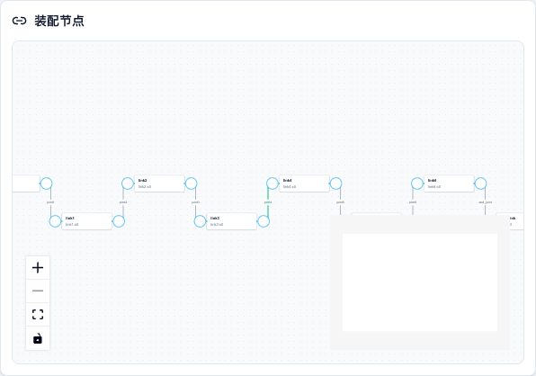
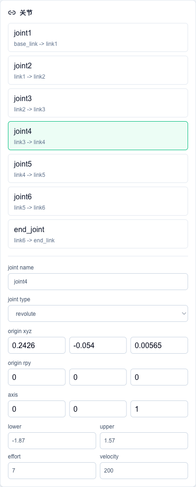
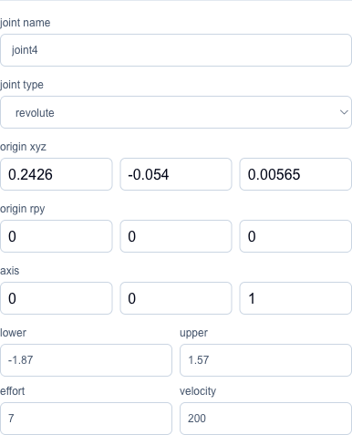

# DeDeUrdf 完整图文使用手册

DeDeUrdf 是一个浏览器端 URDF 装配工具。它可以把 STL 模型、link 参数、joint 参数和装配关系整理成可保存的项目，并导出普通 URDF ZIP 或 MuJoCo 可直接加载的 URDF ZIP。

在线访问：

<https://dedeurdf.vercel.app/>

本文档中的截图来自线上站点，并使用内置 RSReBot 示例项目演示完整流程。

## RSReBot 示例文件下载

如果你想跟着本文档复现完整流程，可以先下载 RSReBot 示例文件：

| 文件 | 大小 | 用途 | 下载 |
| --- | --- | --- | --- |
| `RSReBot.f3z` | 约 17.8MB | Fusion 360 原始项目归档，适合继续编辑 CAD、检查装配关系、重新导出 STL | [下载](https://pub-6c1e280a27614b05891bfd818585735e.r2.dev/RSReBot/RSReBot.f3z) |
| `RSReBot.step` | 约 16.3MB | 通用 CAD 交换格式，适合 SolidWorks、FreeCAD、Onshape 等工具查看或转换 | [下载](https://pub-6c1e280a27614b05891bfd818585735e.r2.dev/RSReBot/RSReBot.step) |
| `RSReBot_accurate_web_project.zip` | 约 9.6MB | DeDeUrdf 可继续编辑项目，打开 DeDeUrdf 后点击“导入 JSON/ZIP”选择它 | [下载](https://pub-6c1e280a27614b05891bfd818585735e.r2.dev/RSReBot/RSReBot_accurate_web_project.zip) |
| `RSReBot_fluxweave_dm_mujoco_urdf.zip` | 约 20.2MB | MuJoCo 可加载 URDF 包，包含 `urdf/` 和 `meshes/` | [下载](https://pub-6c1e280a27614b05891bfd818585735e.r2.dev/RSReBot/RSReBot_fluxweave_dm_mujoco_urdf.zip) |

推荐选择：

- 想在 DeDeUrdf 里继续调关节和导出：下载 `RSReBot_accurate_web_project.zip`。
- 想直接去 MuJoCo 里加载和跑控制：下载 `RSReBot_fluxweave_dm_mujoco_urdf.zip`。
- 想回到 CAD 源头重新测量、修改或导出 STL：下载 `RSReBot.f3z` 或 `RSReBot.step`。

## 0. 先理解一个关键点

用户在页面里选择 STL、JSON、ZIP 或文件夹时，文件不会上传到 Vercel。DeDeUrdf 只在浏览器内存中读取和处理这些文件。

Vercel 只负责提供网页代码和内置示例资源。用户自己的机器人模型文件只有在用户手动保存或导出时，才会由浏览器生成本地下载文件。

## 1. 打开页面

打开 <https://dedeurdf.vercel.app/> 后，页面会分成三个主要区域：

- 左侧：项目和部件。
- 中间：3D STL 预览和装配节点。
- 右侧：关节参数和 URDF 预览。


顶部工具栏是最常用的操作入口：


每个按钮的作用：

| 按钮 | 作用 |
|---|---|
| `MuJoCo 示例` | 直接加载网站内置 RSReBot 示例。 |
| `导入 JSON/ZIP` | 导入保存过的项目 JSON 或项目 ZIP。 |
| `导入文件夹` | 一次性导入项目 JSON 和所有 STL，最推荐用于完整项目。 |
| `保存 JSON` | 只保存项目参数，不保存 STL 文件本体。 |
| `保存项目 ZIP` | 保存项目参数和 STL，后续可继续编辑。 |
| `导出 URDF ZIP` | 导出普通 URDF 包。 |
| `导出 MuJoCo ZIP` | 导出 MuJoCo 可加载的 URDF 包。 |

## 2. 空项目界面怎么看

刚打开页面时，左侧项目面板会显示默认机器人名和两个本地文件入口：



这里可以做三件事：

1. 修改 `robot name`。
2. 点击 `上传 STL` 从零开始导入 STL。
3. 点击 `绑定 STL` 为已导入的 JSON 重新绑定同名 STL。

空项目时，中间的 3D 预览区还没有模型：



这时可以先导入一个完整项目，或上传至少两个 STL 让 DeDeUrdf 自动生成链式 joint。

## 3. 推荐方式：导入完整项目文件夹

如果你已经有项目 JSON 和 STL 文件，最推荐使用 `导入文件夹`。这样一次导入后，参数、STL、3D 预览和装配关系都会恢复。

### 3.1 推荐文件夹结构

DeDeUrdf 推荐下面这种结构：

```text
MyRobot/
├── project.fluxweave.json
└── meshes/
    ├── base.stl
    ├── link1.stl
    ├── link2.stl
    └── ...
```

也兼容下面这种结构：

```text
MyRobot/
├── RSReBot_fluxweave_dm_project.json
└── metadata_stl/
    ├── base.stl
    ├── link1.stl
    ├── link2.stl
    └── ...
```

本文档使用的内置示例目录是：

```text
public/examples/rsrebot-mujoco/
├── RSReBot_fluxweave_dm_project.json
└── metadata_stl/
    ├── base.stl
    ├── link1.stl
    ├── link2.stl
    ├── link3.stl
    ├── link4.stl
    ├── link5.stl
    ├── link6.stl
    └── end.stl
```

### 3.2 导入步骤

1. 点击顶部 `导入文件夹`。
2. 在系统文件选择器里选择项目目录。
3. 浏览器读取目录中的 JSON 和 STL。
4. 等待模型显示。

导入成功后，会看到：

- `robot name` 恢复为项目名称。
- 左侧出现所有 link。
- 中间出现整机 3D 预览。
- 下方装配节点出现 link 和 joint 的连接关系。
- 右侧出现所有 joint。
- 顶部保存/导出按钮变为可点击。


导入后，项目面板会显示项目名。顶部工具栏中的 `保存 JSON`、`保存项目 ZIP`、`导出 URDF ZIP`、`导出 MuJoCo ZIP` 也会进入可用状态：



## 4. 用内置示例快速体验

如果你只是想快速看看工具效果，可以点击顶部 `MuJoCo 示例`。

这个按钮会从网站内置资源加载 RSReBot 示例。它和导入完整文件夹后的效果类似，但不需要你手动选择本地文件。

适合：

- 第一次打开页面时快速熟悉界面。
- 检查部署后的 3D 预览是否正常。
- 学习一个完整项目的 link、joint、origin、axis、limit 应该长什么样。

## 5. 从零上传 STL

如果你还没有项目 JSON，可以从左侧 `上传 STL` 开始。

操作方式：

1. 点击左侧 `上传 STL`。
2. 一次选择多个 STL。
3. DeDeUrdf 会按上传顺序自动生成初始链式结构。

初始链式结构类似：

```text
base_link -> link1 -> link2 -> link3 -> ...
```

这种方式适合快速起步，但它不知道真实机器人的关节位置。后续你需要逐个校准：

- link name
- visual origin
- joint name
- joint type
- joint origin xyz/rpy
- joint axis
- joint lower/upper limit

## 6. 导入 JSON/ZIP 和绑定 STL

点击顶部 `导入 JSON/ZIP` 可以导入两类文件：

| 文件 | 是否包含 STL | 适合场景 |
|---|---:|---|
| 项目 JSON | 通常不包含 | 只恢复参数和结构 |
| 项目 ZIP | 通常包含 | 恢复参数、结构和 STL |

如果只导入 JSON，浏览器通常无法自动读取你电脑里的 STL 绝对路径。这时左侧参数会恢复，但 3D 预览可能没有模型。

解决方式：

1. 点击左侧 `绑定 STL`。
2. 重新选择同名 STL。
3. DeDeUrdf 会按文件名把 STL 绑定回对应 link。

为了避免重复绑定，推荐平时使用 `保存项目 ZIP` 保存项目。

## 7. 查看和编辑部件

导入完整项目后，左侧 `部件` 面板会列出所有 link：



每个部件卡片会显示：

- link 名称，例如 `base_link`、`link1`。
- 序号，例如 `#1`、`#2`。
- STL 文件名，例如 `base.stl`、`link1.stl`。

点击某个部件后，下方会显示可编辑参数：

| 字段 | 含义 |
|---|---|
| `link name` | URDF 中的 link 名称。 |
| `visual origin xyz` | mesh 相对 link 坐标系的位置，单位是米。 |
| `visual origin rpy` | mesh 相对 link 坐标系的姿态，单位是弧度。 |
| `color` | 3D 预览颜色和 URDF material 颜色。 |

经验建议：

- 如果 STL 的原点已经在对应 joint 坐标系上，`visual origin xyz/rpy` 通常保持 0。
- 如果 STL 原点不正确，可以在这里临时补偿。
- 更推荐在 CAD 导出时就把每个 STL 的原点对齐到对应关节坐标系。

## 8. 查看整机和单个部件

中间 `3D STL 预览` 有两个模式：



| 模式 | 用途 |
|---|---|
| `整机` | 查看所有部件按当前 joint 关系装配后的结果。 |
| `选中部件` | 只查看左侧当前选中的 STL。 |

如果你想检查单个 STL 的方向、原点或几何细节，可以先点击左侧某个 link，再切换到 `选中部件`。

示例中选中 `link6` 后，只显示该部件：


## 9. 查看装配节点

中间下方 `装配节点` 用图的方式显示 link 和 joint 的连接关系：



节点代表 link，连线代表 joint。

例如：

```text
base_link -- joint1 --> link1
link1     -- joint2 --> link2
link2     -- joint3 --> link3
```

这个视图适合检查：

- 哪些 link 已经接上。
- parent/child 关系是否正确。
- 链路有没有断开。
- joint 名称是否对应正确。

装配节点区左下角有缩放和适配视图按钮。如果节点看起来太小或偏移，可以点击 `Fit View` 让图重新居中。

## 10. 查看和编辑关节

右侧 `关节` 面板会列出所有 joint：



点击某个 joint 后，下方会显示该关节的完整参数：



在完整页面里，关节列表和参数编辑区位于右侧，便于一边看模型、一边调整 joint 参数：


字段说明：

| 字段 | 含义 |
|---|---|
| `joint name` | URDF joint 名称。 |
| `joint type` | 关节类型，例如 `fixed`、`revolute`、`continuous`、`prismatic`。 |
| `origin xyz` | child link 坐标系相对 parent link 坐标系的位置，单位是米。 |
| `origin rpy` | child link 坐标系相对 parent link 坐标系的姿态，单位是弧度。 |
| `axis` | 关节运动轴。 |
| `lower / upper` | 关节运动范围。 |
| `effort / velocity` | 力矩和速度上限。 |

常见设置方式：

- 普通旋转关节：`joint type = revolute`。
- 连续旋转关节：`joint type = continuous`。
- 固定连接：`joint type = fixed`。
- 直线滑动关节：`joint type = prismatic`。
- 绕 Z 轴旋转：`axis = 0, 0, 1`。
- 绕 Y 轴旋转：`axis = 0, 1, 0`。
- 绕 X 轴旋转：`axis = 1, 0, 0`。

如果模型位置不对，最先检查 `origin xyz`。它通常就是相邻两个关节坐标系之间的相对位移。

## 11. 查看 URDF 预览

右下角 `URDF 预览` 会实时显示当前项目生成的 URDF：


你修改任何 link 或 joint 参数后，这里的 XML 会同步变化。

建议重点检查：

```xml
<robot name="...">
<link name="...">
<joint name="..." type="...">
<parent link="...">
<child link="...">
<origin xyz="..." rpy="...">
<axis xyz="...">
<limit lower="..." upper="..." effort="..." velocity="...">
```

如果 URDF 预览里 parent/child 不符合预期，说明装配关系需要调整。

## 12. 保存项目

DeDeUrdf 有两种保存方式：

| 按钮 | 保存内容 | 适合场景 |
|---|---|---|
| `保存 JSON` | 只保存项目参数和结构 | 文件小，适合快速备份参数 |
| `保存项目 ZIP` | 保存项目参数和 STL | 推荐方式，方便下次继续编辑 |

建议开发过程中经常点击 `保存项目 ZIP`，这样下次可以直接用 `导入 JSON/ZIP` 或 `导入文件夹` 恢复完整项目。

## 13. 导出 URDF ZIP

如果你要给 ROS、URDF 工具链或其他机器人软件使用，可以点击：


普通 URDF ZIP 结构：

```text
robot_urdf.zip
├── project.fluxweave.json
├── urdf/
│   └── robot.urdf
└── meshes/
    └── *.stl
```

这个包保留普通 URDF mesh 路径：

```xml
<mesh filename="meshes/base.stl"/>
```

## 14. 导出 MuJoCo ZIP

如果你要给 MuJoCo 使用，可以点击：


MuJoCo URDF ZIP 结构：

```text
robot_mujoco_urdf.zip
├── project.fluxweave.json
├── README.txt
├── urdf/
│   └── robot_mujoco.urdf
└── meshes/
    └── *.stl
```

MuJoCo 版导出会做两件事：

1. 把 mesh 路径写成相对 `urdf/` 文件夹的路径：

```xml
<mesh filename="../meshes/base.stl"/>
```

2. 把 STL 转成 MuJoCo 更容易加载的 binary STL。

加载示例：

```bash
python - <<'PY'
import mujoco
model = mujoco.MjModel.from_xml_path("urdf/robot_mujoco.urdf")
print(model.nbody, model.njnt, model.ngeom)
PY
```

## 15. 建议的完整工作流

如果你从 CAD 软件导出自己的机械臂模型，推荐按下面流程做：

1. 在 CAD 中把机器人拆成多个 link。
2. 每个 link 单独导出 STL。
3. 尽量让每个 STL 的原点对齐到对应 joint 坐标系。
4. 确认单位。URDF 和 MuJoCo 通常按米理解。
5. 打开 DeDeUrdf。
6. 点击 `上传 STL` 或 `导入文件夹`。
7. 先看 `整机` 预览，确认模型大体姿态。
8. 逐个选择部件，检查 link name 和 visual origin。
9. 逐个选择 joint，检查 origin、axis、limit。
10. 看 `装配节点`，确认 parent/child 连接关系。
11. 看 `URDF 预览`，确认 XML 结构。
12. 点击 `保存项目 ZIP` 保存可编辑版本。
13. 点击 `导出 URDF ZIP` 或 `导出 MuJoCo ZIP` 给后续工具链使用。

## 16. 单位和 CAD 导出建议

URDF 和 MuJoCo 通常按米理解。DeDeUrdf 中的 `origin xyz` 也建议使用米。

例如 CAD 中测量值是：

```text
86.8 mm
```

在 DeDeUrdf 里应该写成：

```text
0.0868
```

如果 STL 是按毫米坐标导出的，但 URDF 按米解释，就会出现模型巨大或错位的问题。建议在 CAD 导出阶段就确认：

- STL 坐标单位。
- STL 原点位置。
- 每个 joint 坐标系位置。
- 每个 joint 旋转轴方向。

## 17. 常见问题

### 导入 JSON 后没有 3D 模型

JSON 只保存参数和文件名，不一定包含 STL 文件本体。点击 `绑定 STL`，重新选择同名 STL；或者使用 `保存项目 ZIP` / `导入文件夹` 这种包含 STL 的方式。

### 模型位置不对

优先检查：

- STL 导出原点是否正确。
- 相邻 joint 的 `origin xyz` 是否是两个关节坐标系之间的相对位置。
- `origin rpy` 是否需要旋转补偿。
- `axis` 是否和真实关节旋转轴一致。
- 单位是否把毫米误当成米。

### 为什么导出按钮一开始是灰色的

没有导入 STL 或项目时，DeDeUrdf 没有可导出的 mesh，所以导出按钮会禁用。导入至少一个有效 STL 后，保存和导出按钮会启用。

### 用户文件会不会上传到 Vercel

不会。用户选择的 STL、JSON、ZIP 文件是在浏览器内存中解析，不会上传到 Vercel。只有网页本身和内置示例文件会从 Vercel 下载。

### STL 很大时页面比较慢

这是正常的。DeDeUrdf 在浏览器里解析和渲染 STL，文件越大，加载和 3D 预览越慢。正式项目建议给仿真和网页预览准备简化版 mesh。

### MuJoCo 能直接做控制仿真吗

DeDeUrdf 导出的 MuJoCo ZIP 主要解决几何、link、joint 和 mesh 路径兼容问题。真实控制仿真通常还需要继续补充：

- mass
- inertia
- damping
- friction
- actuator
- controller
- collision 简化模型

## 18. 本地开发和重新部署

本地开发：

```bash
git clone https://github.com/lintheyoung/DeDeUrdf.git
cd DeDeUrdf
nvm use
npm install
npm run dev
```

打开：

```text
http://localhost:3000
```

重新部署到 Vercel：

```bash
npx vercel --prod
```
